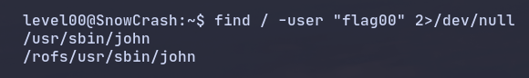

<h1 align="center">Level 00 Walkthrough ~ Simple hash decrypt:</h1>

Al llegar a este nivel me paso un buen rato enumerando ficheros de configuración, puertos abiertos, etc, pero finalmente caigo en la cuenta de que si el objetivo es escalar 
privilegios hacia el usuario $\color{red}{\textsf{flag00}}$ debería buscar ficheros del usuario en cuestión a los que tenga acceso para ver si existe algún binario que 
pudiera explotar o información relevante.

<p align="center"></p>

> Ejecuto una búsqueda en el sistema desde la raíz de ficheros o directorios cuyo propietario sea flag00 desviando los errores a `/dev/null`.

¿John?, para ver que tipo de fichero es:

```bash
file /usr/sbin/john
```
Veo que se trata de un fichero de texto plano cuyo contenido parece una contraseña encriptada, entendiendo que `john` es una pista ya que existe una tool con ese nombre y es 
muy usada para romper contraseñas mediante diccionario, fuerza bruta o técnicas combinadas, además este soporta múltiples algoritmos de cifrado, esto será importante más 
adelante pero el caso es que por la sintaxis del hash, su longitud, uso de carácteres y teniendo en cuenta que estamos en el level00 me lleva a pensar también que 
probablemente se trate de un cifrado césar o ROT13, por lo que visito [ROT13](https://rot13.com) y pruebo diferentes ROTs, 13, 12, 11... Hasta que ¡tachán!.
Consigo la contraseña de flag00, entro en dicho usuario con `su flag00` y ejecuto `getflag` para pasar al [siguiente nivel](../../level01/resources/README.md).
