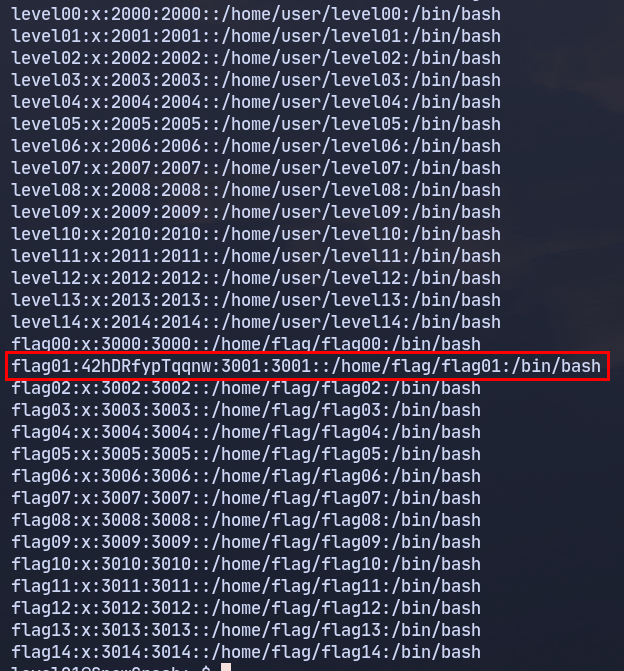

<h1 align="center">Level 01 Walkthrough:</h1>

De la misma forma que antes me dispongo a buscar ficheros de configuración en el sistema que puedan brindarme algo de información que me lleve a escalar privilegios hacia $\color{Red}{\textsf{flag01}}$.
Entre todos los ficheros que voy revisando se encuentra `/etc/passwd` donde veo el vector de ataque de este nivel:

<p align="center"></p>

Como se aprecia en la imagen el usuario flag01 es el único que no es seguido de una `:x:` si no que tiene un "churro" de texto, esto se debe a que antiguamente en sistemas UNIX en este fichero se almacenaban
las contraseñas de los usuarios encriptadas y a la hora de que el sistema le solicitara la contraseña a un usuario para lo que fuera siempre era encriptada y se comparaban los hashes, el encriptado en cuestión
es formato [DES](https://es.wikipedia.org/wiki/Data_Encryption_Standard) y es uno de los algoritmos de encriptación soportados por la herramienta [john](https://es.wikipedia.org/wiki/John_the_Ripper) que mencioné en el nivel anterior.

Por lo que llevo este hash a mi sistema local donde trato de romperlo con john:
```bash
john --format=descrypt hash.txt 
```
Efectivamente me da la contraseña de flag01, entro, ejecuto `getflag` y paso al [siguiente nivel](../../level02/resources/README.md).
