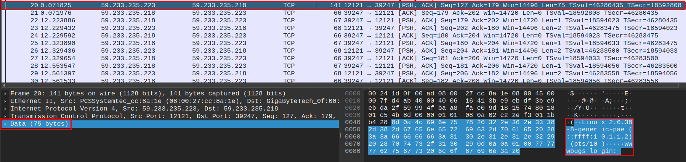
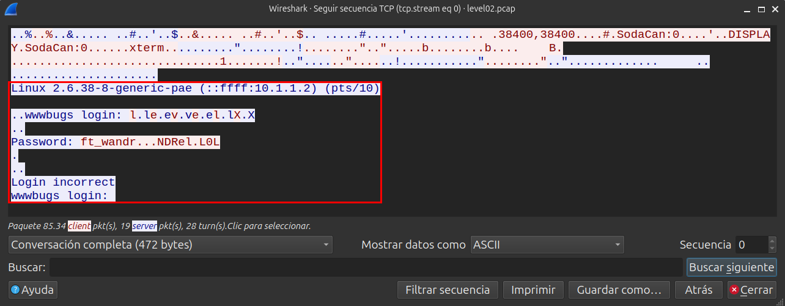
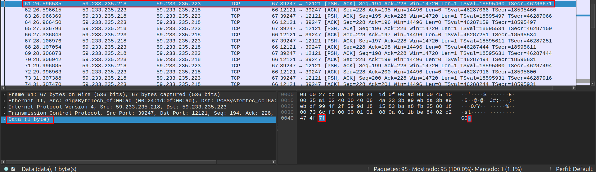

<h1 align="center">Level 02 Walkthrough ~ Network capture file analysis:</h1>

Al llegar a este nivel veo que en mi home encuentro un fichero llamado `level02.pcap`, este fichero es un volcado de tcpdump, 
(se puede apreciar usando `file`) me lo traigo a mi equipo local con scp:
```bash
scp -P 4242 level02@192.168.x.x:/home/user/level02/level02.pcap "$(pwd)"
```
Una vez tengo este fichero en mi poder decido analizarlo con [Wireshark](https://es.wikipedia.org/wiki/Wireshark) para ver qué información puedo sacar, veo una conversación 
entre dos IPs en la que parece que se está dando un intento de login cliente/servidor, lo veo a través de la sección `data` del 
histórico de Wireshark:

<p align="center"></p>

> Recibimos un header de sistema que nos permite enviar nuestro nombre de usuario y contraseña.

Para ver la conversación de una forma más clara utilizo el atajo de teclado
`CTRL` + `ALT` + `SHIFT` + `T`

<p align="center"></p>

> Veo que el intento de login ha sido incorrecto pero podría deberse a que se ha confundido al meter el user pero la contraseña estaba bien, ya que ese usuario no existe en el sistema. 

Sin embargo se aprecian puntos en esa contraseña que no son más que indicadores de que Wireshark no ha podido traducir el valor de ese carácter bajo ese enconder, pero si nos dirigimos 
a los paquetes en cuestión:

<p align="center"></p>

Vemos que esos puntos en realidad son un valor hexadecimal que corresponde al valor 7f, que en decimal es igual a 127, que en la tabla ASCII es `DEL`, es decir, cada '.' es porque el usuario
estaba borrando carácteres en medio de la escritura de la contraseña, por lo que si aplico esa cantidad de borrados la contraseña se me queda en `ft_waNDReLOL`.

Entro en flag02, ejecuto `getflag` y paso al [siguiente nivel](../../level03/resources/README.md).
