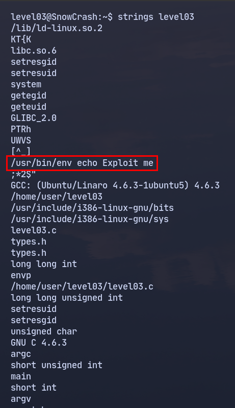
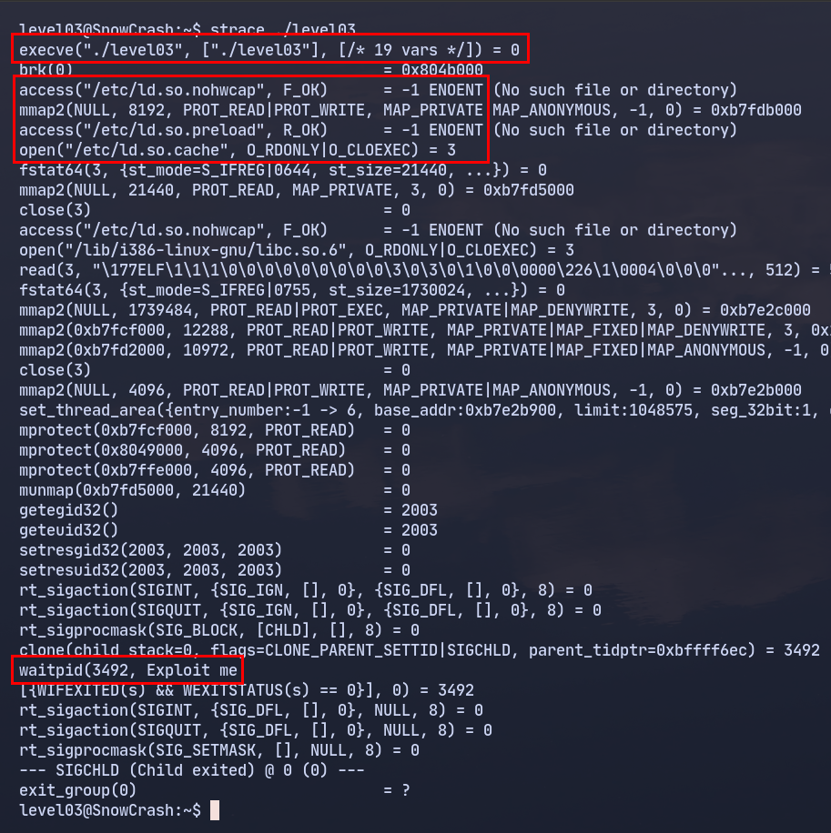
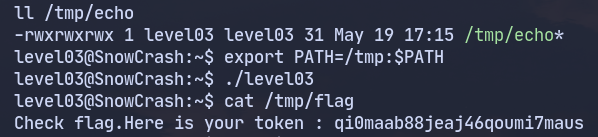

<h1 align="center">Level 03 Walkthrough ~ Path hijacking:</h1>

Al llegar a este nivel veo que en mi home encuentro un fichero llamado `level03`, este fichero es un binario compilado desde C, 
(se puede apreciar usando `file`) ejecuto strings y strace para ver que información puedo sacar:
<p align="center"></p>
Por un lado veo de que forma se está mostrando el mensaje "Exploit me" y veo que probablemente se esté utilizando
execve o derivados para ejecutar el comando echo sin ruta absoluta, si evalúo con strace:

<p align="center"></p>

Como digo el binario está ejecutando [`execve`](https://es.wikipedia.org/wiki/Execve) en un subproceso y por lo que veo se está ejecutando
con `envp` ya que no se está indicando la ruta absoluta de echo, además también se puede ver en la imagen que está cargando librerías dinámicas.

Ahora que se que se está ejecutando el comando `echo` sin una ruta absoluta creo un fichero ejecutable llamado echo con el siguiente contenido:

```bash
echo 'getflag > /tmp/flag' >/tmp/echo && chmod 777 /tmp/echo
```
Y procedo con un path hijacking, se trata de modificar la variable de entorno `$PATH` añadiendo el directorio /tmp para que el programa a la hora
de ejecutar `echo` busque primero en el directorio /tmp y coja mi versión modificada:

```bash
export PATH=/tmp:$PATH
```

<p align="center"></p>

Entro en flag03, ejecuto `getflag` y paso al [siguiente nivel](../../level04/resources/README.md).
