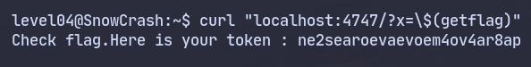

<h1 align="center">Level 04 Walkthrough ~ URL Command injection:</h1>

Al llegar a este nivel veo que en mi home encuentro un fichero llamado `level04`, este fichero es un script 
de perl con el siguiente contenido:
```perl
#!/usr/bin/perl
# localhost:4747
use CGI qw{param};
print "Content-type: text/html\n\n";
sub x {
  $y = $_[0];
  print `echo $y 2>&1`;
}
x(param("x"));
```

> Este envía un header http y nos da la pista de que el servicio está ejecutándose en segundo plano en nombre
> de `flag05` escuchando en el puerto 4747 que está esperando un parámetro `x` el cual imprimirá...

Así que decido inyectar `$(getflag)` para que el `echo` lo ejecute y me muestre el resultado
ayudándome de curl:

<p align="center"></p>

Entro en flag04, ejecuto `getflag` y paso al [siguiente nivel](../../level05/resources/README.md).
